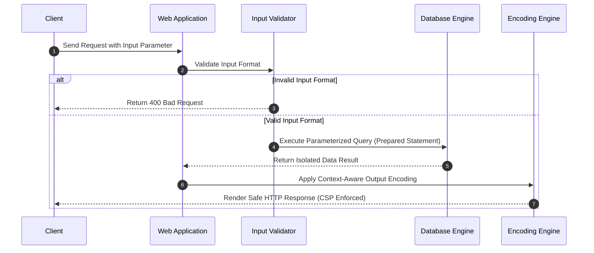
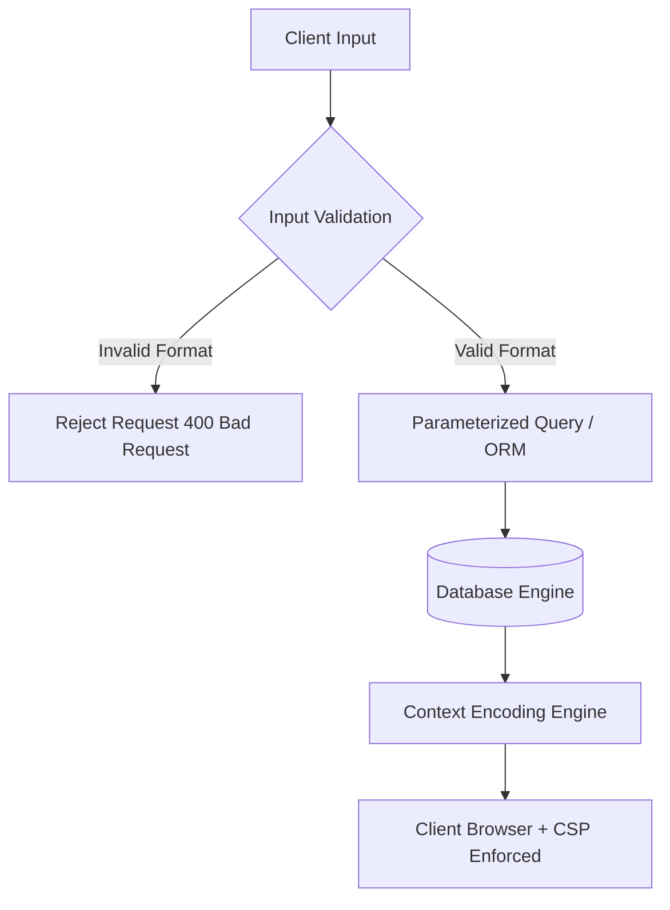

# 🌐 Module 02: Web Application Vulnerabilities & Remediation Architecture

This notebook section details the security mechanics, mathematical models, tool specifications, and defensive engineering controls for Cross-Site Scripting (XSS) and SQL Injection (SQLi).

---

## 📐 1. Technical Concepts & Mathematical Models

### A. SQL Injection (SQLi) Mechanics
SQL Injection occurs when untrusted user input $I$ is directly concatenated into a dynamic database query string $Q(I)$:

$$\text{Vulnerable Query: } Q(I) = \text{"SELECT * FROM users WHERE id = "} + I$$

If an attacker inputs $I = \text{"1 OR 1=1"}$, the Boolean truth value evaluates to:

$$\text{Evaluated Logic: } \forall x \, (\text{id} = 1 \lor \text{True}) \equiv \text{True}$$

This alters the database interpreter execution flow, returning all database records.

#### Prepared Statement (Parameterized Query) Defense Mechanics
Parameterized queries separate code execution from data representation:

$$\text{Secure Query: } Q_{\text{prepared}} = \text{"SELECT * FROM users WHERE id = ?"}$$

The database engine pre-compiles the query template $Q$, binding parameter $I$ strictly as a literal data value (type-checked string/integer), preventing SQL syntax tree modification regardless of input contents.



---

## 🛠️ 2. Core Tool Breakdown (SQLmap)

SQLmap is an open-source penetration testing tool that automates the process of detecting and exploiting SQL injection flaws.

```bash
sqlmap -u "https://target.com/item.php?id=10" --batch --dbs --random-agent --level=2 --risk=1
```

### Parameter Breakdown:
- `-u <url>` : Target HTTP endpoint URL with vulnerable GET/POST parameter.
- `--batch` : Non-interactive mode, automatically using default choices for user prompts.
- `--dbs` : Enumerate backend Database Management System (DBMS) database names.
- `--random-agent` : Randomize HTTP `User-Agent` request header to prevent basic UA blocking.
- `--level=1..5` : Level of tests to perform (Level 2+ adds HTTP `Cookie` header testing; Level 3+ adds `User-Agent`/`Referer` testing).
- `--risk=1..3` : Risk rating of tests to perform (Risk 1 is safe; Risk 2 adds heavy time-based queries; Risk 3 adds `OR`-based tests).

---

## 🛡️ 3. Defensive Security Architecture



### Key Mitigation Checklist:
1. **Parameterized Queries:** Use PDO (PHP), PreparedStatement (Java), parameterized queries (Python/Node.js).
2. **Content Security Policy (CSP):** Set HTTP response header:
   ```http
   Content-Security-Policy: default-src 'self'; script-src 'self' https://trusted-cdn.com; object-src 'none';
   ```
