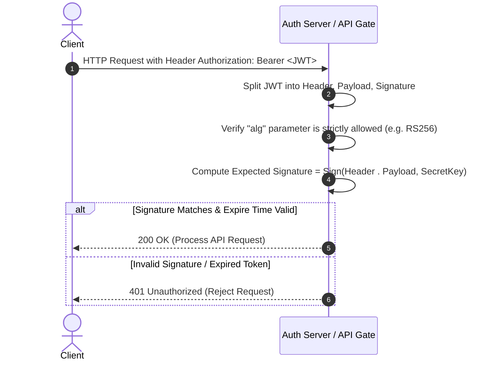

# 🔑 Module 03: API Security & Token Architecture

This notebook section covers JSON Web Token (JWT) structure, signature algorithms, authorization models, and API endpoint fuzzing flags.

---

## 📐 1. Technical Concepts & Mathematical Models

### A. JWT Structure & Cryptographic Signatures
A JSON Web Token consists of three Base64URL-encoded components separated by dots (`.`):

$$\text{JWT} = \text{Base64URL}(H) \,.\, \text{Base64URL}(P) \,.\, S$$

Where:
- $H$ = Header (Algorithm & Token Type, e.g., `{"alg": "HS256", "typ": "JWT"}`).
- $P$ = Payload (Claims, e.g., `{"sub": "12345", "role": "user", "exp": 1700000000}`).
- $S$ = Cryptographic Signature.



#### HMAC-SHA256 Signature Formula ($S_{\text{HMAC}}$)
For symmetric signing (`HS256`), signature $S$ is generated using a shared secret key $K$:

$$S = \text{HMAC-SHA256}\Big(K, \; \text{Base64URL}(H) + \text{"."} + \text{Base64URL}(P)\Big)$$

---

## 🛠️ 2. Core Tool Breakdown (FFUF - Fast Web Fuzzer)

FFUF is a high-speed web fuzzer written in Go used for parameter discovery and endpoint mapping.

```bash
ffuf -w /usr/share/wordlists/dirb/common.txt -u https://api.target.com/v1/FUZZ -mc 200,401,403 -sf -rate 100
```

### Parameter Breakdown:
- `-w <file>` : Path to wordlist file containing payload strings.
- `-u <url>` : Target URL containing the string `FUZZ` which gets replaced by wordlist keywords.
- `-mc <codes>` : Match HTTP status codes (e.g., `200`, `401`, `403`).
- `-sf` : Stop execution on dummy / redirect loops.
- `-rate <N>` : Limit request rate to $N$ requests per second.
