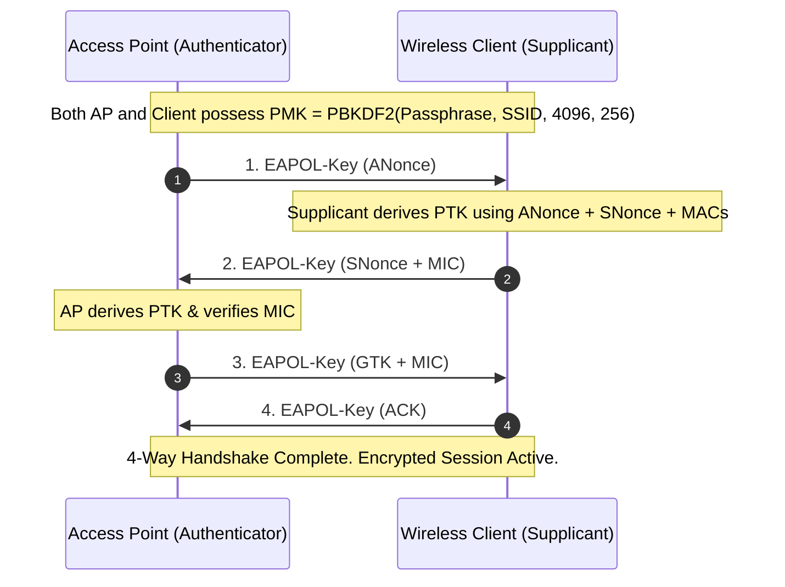

# 📡 Module 05: Wireless Security & Cryptographic Handshakes

This notebook section covers 802.11 wireless frame structures, WPA2 4-Way Handshake cryptography, key derivation functions (PBKDF2), and tool specifications.

---

## 📐 1. Technical Concepts & Mathematical Models

### A. WPA2 4-Way Handshake Exchange Diagram



### B. Pairwise Master Key (PMK) Derivation Math
The PMK is computed using the WPA passphrase and Network SSID via **PBKDF2** (Password-Based Key Derivation Function 2) with 4096 HMAC-SHA1 iterations:

$$\text{PMK} = \text{PBKDF2-HMAC-SHA1}\big(\text{Passphrase}, \; \text{SSID}, \; 4096, \; 256\big)$$

---

## 🛠️ 2. Core Tool Breakdown (Aircrack-ng Suite)

```bash
airodump-ng -c 6 --bssid 00:11:22:33:44:55 -w capture_output wlan0mon
```

### Parameter Breakdown:
- `-c <channel>` : Lock wireless interface to specific 802.11 RF channel (e.g. Channel 6).
- `--bssid <MAC>` : Filter capture strictly to target Access Point BSSID MAC address.
- `-w <prefix>` : Write captured packet frames to file (`capture_output-01.cap`).
