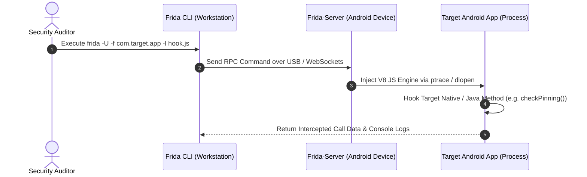

# 📱 Module 10: Mobile Security & Dynamic Instrumentation Architecture

This notebook section details Android Application security models, Frida dynamic instrumentation architecture, Certificate Pinning configurations, and KernelSU SUSFS concepts.

---

## 📐 1. Technical Concepts & Application Security

### A. Frida Dynamic Instrumentation Architecture Flow



### B. Android Network Security Configuration Schema
Android applications enforce Certificate Pinning by pinning SHA-256 hashes of server Subject Public Key Info (SPKI) inside `res/xml/network_security_config.xml`:

```xml
<?xml version="1.0" encoding="utf-8"?>
<network-security-config>
    <domain-config cleartextTrafficPermitted="false">
        <domain includeSubdomains="true">target.com</domain>
        <pin-set expiration="2027-01-01">
            <pin digest="SHA-256">7HI72MDIGhhwAzRBsIy82uKccVYyR67PJvhfg1WKZvM=</pin>
        </pin-set>
    </domain-config>
</network-security-config>
```
