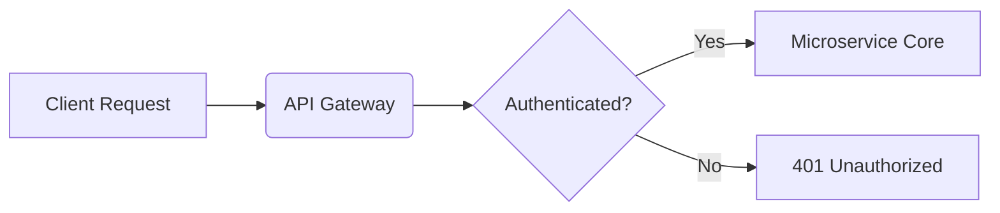

# 📝 Module 17: GitHub Flavored Markdown (GFM) Syntax Cheatsheet

Complete reference for Markdown formatting, GFM Alert blocks, LaTeX KaTeX mathematical formulas, and Mermaid diagram syntax.

---

## ⚡ 1. GitHub Flavored Markdown (GFM) Alerts

```markdown
> [!NOTE]
> Useful background information and implementation details.

> [!TIP]
> Helpful advice for performance optimization and efficiency.

> [!IMPORTANT]
> Crucial information required for correct execution.

> [!WARNING]
> Critical warnings regarding breaking changes or security issues.
```

---

## 📐 2. LaTeX KaTeX Mathematical Expression Syntax

```markdown
# Inline Math Syntax:
Use single dollar signs: $E = mc^2$ or $\sum_{i=1}^{n} i$

# Display Math Syntax (Centered Block):
$$H(X) = -\sum_{i=1}^{n} P(x_i) \log_2 P(x_i)$$
```

---

## 🎨 3. Mermaid Diagram Syntax

```markdown

```
