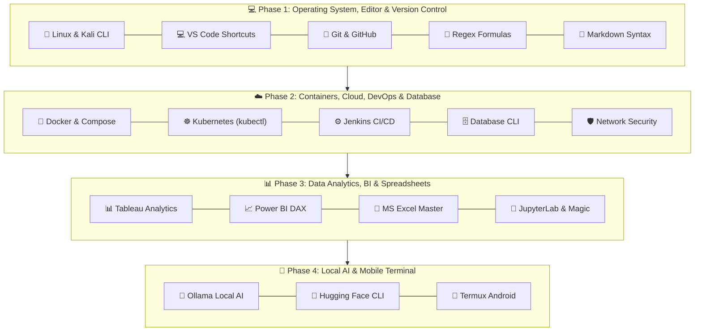

<div align="center">

# 📻 BugFix FM
### *The Ultimate Professional Developer, Cloud, DevOps, Database & Analytics Master Shortcut Booklet*

[](https://github.com/techindro/Penetration-testing-toolkit/stargazers)
[](https://github.com/techindro/Penetration-testing-toolkit/network/members)
[](LICENSE)
[](https://github.com/techindro/Penetration-testing-toolkit/pulls)
[](https://github.com/techindro/Penetration-testing-toolkit)

<p align="center">
  <b>A curated, daily-use shortcut & formula booklet written in natural human language with real-world practical usage examples across 17 core engineering and analytics domains.</b>
</p>

[Explore Booklet Modules](#-17-master-shortcut-modules) • [Visual Architecture](#-ecosystem-architecture) • [External Resources](#-essential-resources)

</div>

---

## ✨ Why BugFix FM?

- 🗣️ **Natural Human Language:** Clear, jargon-free explanations of complex commands, DAX formulas, regex, and CLI flags.
- 💡 **Real-World Practical Examples:** Every single shortcut, formula, DAX measure, XLOOKUP, and CLI tool includes a concrete usage example.
- ⚡ **Zero Setup Required:** Pure, lightweight GitHub Markdown sheets optimized for fast searching and instant viewing.
- 🚀 **GitHub Browser Ready:** Press `.` on your keyboard anywhere in this repository to open full VS Code Web directly!

---

## 🎨 Ecosystem Architecture



---

## 📌 17 Master Shortcut Modules

| Module ID | Category / Field | Core Focus & Highlighted Formulas | Booklet Link |
| :-: | :--- | :--- | :-: |
| **01** | **🐧 Linux & Kali Linux** | `Ctrl+R` (Search history), `sudo !!`, `cd -`, `nohup`, `tail -f`, `pkill` | [**Open Sheet**](01-linux-and-kali-shortcuts/SHEET.md) |
| **02** | **💻 VS Code Editor** | `Ctrl+P` (Quick open), `Ctrl+Shift+P`, `Alt+Click` multi-cursor, `Ctrl+D` | [**Open Sheet**](02-vscode-keyboard-tricks/SHEET.md) |
| **03** | **🐙 Git & GitHub** | `git log --oneline --graph`, `git stash`, `git reset --soft`, GitHub `.` key | [**Open Sheet**](03-github-and-git-shortcuts/SHEET.md) |
| **04** | **🐳 Docker Containers** | `docker exec -it`, stop/rm all containers, `docker system prune -a` | [**Open Sheet**](04-docker-containers-tricks/SHEET.md) |
| **05** | **☸️ Kubernetes (kubectl)** | `kubectl get pods -A`, `describe`, `logs -f`, `port-forward`, namespace | [**Open Sheet**](05-kubernetes-kubectl-tricks/SHEET.md) |
| **06** | **📊 Tableau Analytics** | Calculated Fields `IF/THEN`, FIXED / INCLUDE / EXCLUDE LOD, `Ctrl+W` | [**Open Sheet**](06-tableau-analytics-formulas/SHEET.md) |
| **07** | **📈 Power BI DAX** | DAX Measures (`SUM`, `CALCULATE`, `DIVIDE`, `TOTALYTD`, `SAMEPERIODLASTYEAR`) | [**Open Sheet**](07-powerbi-dax-formulas/SHEET.md) |
| **08** | **📗 MS Excel Master** | `XLOOKUP`, `INDEX+MATCH`, `SUMIFS`, `IFS`, `F4` (`$A$1`), `Alt+=` AutoSum | [**Open Sheet**](08-excel-master-formulas/SHEET.md) |
| **09** | **🦙 Ollama Local AI** | `ollama run llama3`, `ollama list`, `ollama ps`, Modelfile customization | [**Open Sheet**](09-ollama-local-ai-tricks/SHEET.md) |
| **10** | **🤗 Hugging Face** | `huggingface-cli download`, GGUF model files, Python `snapshot_download()` | [**Open Sheet**](10-huggingface-cli-python-tricks/SHEET.md) |
| **11** | **📱 Termux Android** | `termux-setup-storage`, `sshd` server on phone, `termux-wake-lock` | [**Open Sheet**](11-termux-android-shortcuts/SHEET.md) |
| **12** | **⚙️ Jenkins CI/CD** | Declarative `Jenkinsfile` pipeline syntax, Docker agent, Jenkins CLI API | [**Open Sheet**](12-jenkins-cicd-shortcuts/SHEET.md) |
| **13** | **📓 JupyterLab & Magic** | `Shift+Enter` run cell, `A`/`B`/`D+D`, Magic `%timeit`, `%pip`, `%debug` | [**Open Sheet**](13-jupyterlab-keyboard-shortcuts/SHEET.md) |
| **14** | **🛡️ Network Security** | `nmap -sS -sV`, `tcpdump -i eth0`, `tshark`, `nc -zv` connection test | [**Open Sheet**](14-cyber-security-network-diagnostics/SHEET.md) |
| **15** | **🗄️ Database CLI** | PostgreSQL `psql` (`\dt`), MySQL (`mysql -u`), MongoDB (`mongosh`), Redis | [**Open Sheet**](15-database-cli-shortcuts/SHEET.md) |
| **16** | **🔣 Regex Formulas** | Email, IPv4, URL validation regex formulas, Lookaheads `(?=...)`, Grep | [**Open Sheet**](16-regex-regular-expressions/SHEET.md) |
| **17** | **📝 Markdown Syntax** | GFM Alerts (`[!NOTE]`, `[!WARNING]`), KaTeX Math `$$...$$`, Mermaid diagrams | [**Open Sheet**](17-markdown-syntax-cheatsheet/SHEET.md) |

---

## 📻 Essential Resources

- 🌐 [PortSwigger Web Security Academy](https://portswigger.net/web-security) - Free interactive web security learning platform.
- 📖 [OWASP Web Security Testing Guide (WSTG)](https://github.com/OWASP/wstg) - Industry standard security auditing methodology.
- 🧰 [PayloadsAllTheThings](https://github.com/swisskyrepo/PayloadsAllTheThings) - Comprehensive security study guide & payload repository.
- 📋 [SecLists](https://github.com/danielmiessler/SecLists) - Security wordlists for username/password discovery and testing.

---

## 📂 Repository Directory Layout

```
BugFix-FM-Master-Shortcut-Booklet/
├── 01-linux-and-kali-shortcuts/        # SHEET.md (Linux & Kali CLI)
├── 02-vscode-keyboard-tricks/          # SHEET.md (VS Code Keyboard Shortcuts)
├── 03-github-and-git-shortcuts/        # SHEET.md (Git One-Liners & GitHub Web)
├── 04-docker-containers-tricks/        # SHEET.md (Docker & Compose Administration)
├── 05-kubernetes-kubectl-tricks/       # SHEET.md (Kubectl Pods, Logs & Forwarding)
├── 06-tableau-analytics-formulas/      # SHEET.md (Tableau LOD Expressions & Formulas)
├── 07-powerbi-dax-formulas/            # SHEET.md (Power BI DAX Measures & YTD Functions)
├── 08-excel-master-formulas/           # SHEET.md (XLOOKUP, INDEX+MATCH, SUMIFS, IFS)
├── 09-ollama-local-ai-tricks/          # SHEET.md (Ollama Run, List & Modelfile)
├── 10-huggingface-cli-python-tricks/   # SHEET.md (Hugging Face CLI & Python Snapshots)
├── 11-termux-android-shortcuts/        # SHEET.md (Termux Setup, Storage & SSHD)
├── 12-jenkins-cicd-shortcuts/          # SHEET.md (Declarative Jenkinsfile & Docker Runner)
├── 13-jupyterlab-keyboard-shortcuts/   # SHEET.md (JupyterLab Shortcuts & %timeit Magic)
├── 14-cyber-security-network-diagnostics/ # SHEET.md (Nmap, Tcpdump, Tshark, Netcat)
├── 15-database-cli-shortcuts/          # SHEET.md (PostgreSQL psql, MySQL, MongoDB, Redis)
├── 16-regex-regular-expressions/       # SHEET.md (Email, IP, URL Validation Regex)
├── 17-markdown-syntax-cheatsheet/      # SHEET.md (GFM Alerts, KaTeX Math & Mermaid)
└── README.md                           # Master Booklet Entry
```

---

<div align="center">

### ⭐ If you find BugFix FM helpful, please give it a Star! ⭐

**Maintained by [Shubham Patel (techindro)](https://github.com/techindro)**

</div>
