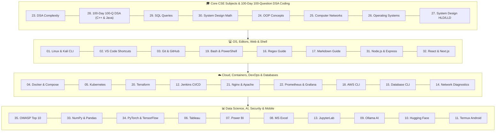

# 📻 BugFix FM
### *Simple & Practical Developer, Cloud, DevOps & Analytics Cheat Sheet Booklet*

  <b>A collection of 35 practical cheat sheets featuring a 100-Day 100-Question LeetCode Practice Plan (Day 1 to Day 100) in both C++ and Java for everyday use by engineering students and developers. Simple language, no complex jargon.</b>

[Browse All 35 Modules](#-35-cheat-sheet-modules) • [System Flow](#-system-flow) • [Useful Links](#-useful-links)

---

## 📌 Features

- 📄 **Simple Human Language:** Easy to read, clear explanations without unnecessary complicated words.
- 💡 **100-Day 100-Question LeetCode Plan:** Exact 100 LeetCode problems mapped Day 1 to Day 100 pattern-wise with approach comparison (Brute Force ➔ Optimal) and solutions in **BOTH C++ and Java**.
- 💡 **Real Examples:** Every command, formula, and shortcut includes a real working example.
- 📥 **Direct File Links:** Download any markdown file directly using raw links.
- 🌐 **Software Links:** Direct links to official download pages for all tools.
- 🚀 **Quick View:** Press `.` on your keyboard in this repository to open VS Code Web directly.

---

## 🎨 System Flow

---

## 📌 35 Cheat Sheet Modules

| Module ID | Topic / Tool | Read Sheet | Direct RAW File | Official Website |
| :-: | :--- | :-: | :-: | :-: |
| **01** | **🐧 Linux & Kali Linux** | [Read Sheet](01-linux-and-kali-shortcuts/SHEET.md) | [📥 Download RAW](https://raw.githubusercontent.com/techindro/Penetration-testing-toolkit/main/01-linux-and-kali-shortcuts/SHEET.md) | [Kali Linux](https://www.kali.org/) |
| **02** | **💻 VS Code Editor** | [Read Sheet](02-vscode-keyboard-tricks/SHEET.md) | [📥 Download RAW](https://raw.githubusercontent.com/techindro/Penetration-testing-toolkit/main/02-vscode-keyboard-tricks/SHEET.md) | [VS Code](https://code.visualstudio.com/) |
| **03** | **🐙 Git & GitHub** | [Read Sheet](03-github-and-git-shortcuts/SHEET.md) | [📥 Download RAW](https://raw.githubusercontent.com/techindro/Penetration-testing-toolkit/main/03-github-and-git-shortcuts/SHEET.md) | [Git SCM](https://git-scm.com/) |
| **04** | **🐳 Docker Containers** | [Read Sheet](04-docker-containers-tricks/SHEET.md) | [📥 Download RAW](https://raw.githubusercontent.com/techindro/Penetration-testing-toolkit/main/04-docker-containers-tricks/SHEET.md) | [Docker](https://www.docker.com/) |
| **05** | **☸️ Kubernetes (kubectl)** | [Read Sheet](05-kubernetes-kubectl-tricks/SHEET.md) | [📥 Download RAW](https://raw.githubusercontent.com/techindro/Penetration-testing-toolkit/main/05-kubernetes-kubectl-tricks/SHEET.md) | [Kubernetes](https://kubernetes.io/) |
| **06** | **📊 Tableau Analytics** | [Read Sheet](06-tableau-analytics-formulas/SHEET.md) | [📥 Download RAW](https://raw.githubusercontent.com/techindro/Penetration-testing-toolkit/main/06-tableau-analytics-formulas/SHEET.md) | [Tableau](https://www.tableau.com/) |
| **07** | **📈 Power BI DAX** | [Read Sheet](07-powerbi-dax-formulas/SHEET.md) | [📥 Download RAW](https://raw.githubusercontent.com/techindro/Penetration-testing-toolkit/main/07-powerbi-dax-formulas/SHEET.md) | [Power BI](https://powerbi.microsoft.com/) |
| **08** | **📗 MS Excel Master** | [Read Sheet](08-excel-master-formulas/SHEET.md) | [📥 Download RAW](https://raw.githubusercontent.com/techindro/Penetration-testing-toolkit/main/08-excel-master-formulas/SHEET.md) | [MS Excel](https://www.microsoft.com/excel) |
| **09** | **🦙 Ollama Local AI** | [Read Sheet](09-ollama-local-ai-tricks/SHEET.md) | [📥 Download RAW](https://raw.githubusercontent.com/techindro/Penetration-testing-toolkit/main/09-ollama-local-ai-tricks/SHEET.md) | [Ollama](https://ollama.com/) |
| **10** | **🤗 Hugging Face** | [Read Sheet](10-huggingface-cli-python-tricks/SHEET.md) | [📥 Download RAW](https://raw.githubusercontent.com/techindro/Penetration-testing-toolkit/main/10-huggingface-cli-python-tricks/SHEET.md) | [Hugging Face](https://huggingface.co/) |
| **11** | **📱 Termux Android** | [Read Sheet](11-termux-android-shortcuts/SHEET.md) | [📥 Download RAW](https://raw.githubusercontent.com/techindro/Penetration-testing-toolkit/main/11-termux-android-shortcuts/SHEET.md) | [Termux](https://f-droid.org/packages/com.termux/) |
| **12** | **⚙️ Jenkins CI/CD** | [Read Sheet](12-jenkins-cicd-shortcuts/SHEET.md) | [📥 Download RAW](https://raw.githubusercontent.com/techindro/Penetration-testing-toolkit/main/12-jenkins-cicd-shortcuts/SHEET.md) | [Jenkins](https://www.jenkins.io/) |
| **13** | **📓 JupyterLab & Magic** | [Read Sheet](13-jupyterlab-keyboard-shortcuts/SHEET.md) | [📥 Download RAW](https://raw.githubusercontent.com/techindro/Penetration-testing-toolkit/main/13-jupyterlab-keyboard-shortcuts/SHEET.md) | [Jupyter](https://jupyter.org/) |
| **14** | **🛡️ Network Diagnostics** | [Read Sheet](14-cyber-security-network-diagnostics/SHEET.md) | [📥 Download RAW](https://raw.githubusercontent.com/techindro/Penetration-testing-toolkit/main/14-cyber-security-network-diagnostics/SHEET.md) | [Nmap](https://nmap.org/) |
| **15** | **🗄️ Database CLI** | [Read Sheet](15-database-cli-shortcuts/SHEET.md) | [📥 Download RAW](https://raw.githubusercontent.com/techindro/Penetration-testing-toolkit/main/15-database-cli-shortcuts/SHEET.md) | [PostgreSQL](https://www.postgresql.org/) |
| **16** | **🔣 Regex Guide** | [Read Sheet](16-regex-regular-expressions/SHEET.md) | [📥 Download RAW](https://raw.githubusercontent.com/techindro/Penetration-testing-toolkit/main/16-regex-regular-expressions/SHEET.md) | [Regex101](https://regex101.com/) |
| **17** | **📝 Markdown Guide** | [Read Sheet](17-markdown-syntax-cheatsheet/SHEET.md) | [📥 Download RAW](https://raw.githubusercontent.com/techindro/Penetration-testing-toolkit/main/17-markdown-syntax-cheatsheet/SHEET.md) | [GitHub Markdown](https://github.github.com/gfm/) |
| **18** | **☁️ AWS CLI** | [Read Sheet](18-aws-cloud-cli-shortcuts/SHEET.md) | [📥 Download RAW](https://raw.githubusercontent.com/techindro/Penetration-testing-toolkit/main/18-aws-cloud-cli-shortcuts/SHEET.md) | [AWS CLI](https://aws.amazon.com/cli/) |
| **19** | **📜 Shell Scripting** | [Read Sheet](19-bash-powershell-scripting-shortcuts/SHEET.md) | [📥 Download RAW](https://raw.githubusercontent.com/techindro/Penetration-testing-toolkit/main/19-bash-powershell-scripting-shortcuts/SHEET.md) | [PowerShell](https://github.com/PowerShell/PowerShell) |
| **20** | **🏗️ Terraform** | [Read Sheet](20-terraform-iac-shortcuts/SHEET.md) | [📥 Download RAW](https://raw.githubusercontent.com/techindro/Penetration-testing-toolkit/main/20-terraform-iac-shortcuts/SHEET.md) | [Terraform](https://www.terraform.io/) |
| **21** | **🌐 Nginx & Apache** | [Read Sheet](21-nginx-apache-webservers/SHEET.md) | [📥 Download RAW](https://raw.githubusercontent.com/techindro/Penetration-testing-toolkit/main/21-nginx-apache-webservers/SHEET.md) | [Nginx](https://nginx.org/) |
| **22** | **📊 Prometheus & Grafana** | [Read Sheet](22-prometheus-grafana-monitoring/SHEET.md) | [📥 Download RAW](https://raw.githubusercontent.com/techindro/Penetration-testing-toolkit/main/22-prometheus-grafana-monitoring/SHEET.md) | [Grafana](https://grafana.com/) |
| **23** | **⚡ DSA Complexity** | [Read Sheet](23-dsa-data-structures-algorithms-complexity/SHEET.md) | [📥 Download RAW](https://raw.githubusercontent.com/techindro/Penetration-testing-toolkit/main/23-dsa-data-structures-algorithms-complexity/SHEET.md) | [Big-O Guide](https://www.bigocheatsheet.com/) |
| **24** | **🧩 OOP & Design Patterns** | [Read Sheet](24-oop-principles-design-patterns/SHEET.md) | [📥 Download RAW](https://raw.githubusercontent.com/techindro/Penetration-testing-toolkit/main/24-oop-principles-design-patterns/SHEET.md) | [Design Patterns](https://refactoring.guru/) |
| **25** | **🌐 Computer Networks** | [Read Sheet](25-computer-networks-protocols-subnetting/SHEET.md) | [📥 Download RAW](https://raw.githubusercontent.com/techindro/Penetration-testing-toolkit/main/25-computer-networks-protocols-subnetting/SHEET.md) | [Wireshark](https://www.wireshark.org/) |
| **26** | **💻 Operating Systems** | [Read Sheet](26-operating-systems-deadlock-scheduling/SHEET.md) | [📥 Download RAW](https://raw.githubusercontent.com/techindro/Penetration-testing-toolkit/main/26-operating-systems-deadlock-scheduling/SHEET.md) | [Ubuntu](https://ubuntu.com/) |
| **27** | **📐 System Design HLD/LLD** | [Read Sheet](27-system-design-hld-lld-cap-theorem/SHEET.md) | [📥 Download RAW](https://raw.githubusercontent.com/techindro/Penetration-testing-toolkit/main/27-system-design-hld-lld-cap-theorem/SHEET.md) | [ByteByteGo](https://bytebytego.com/) |
| **28** | **💡 100-Day 100-Q DSA (C++ & Java)** | [Read Sheet](28-leetcode-dsa-patterns-cheatsheet/SHEET.md) | [📥 Download RAW](https://raw.githubusercontent.com/techindro/Penetration-testing-toolkit/main/28-leetcode-dsa-patterns-cheatsheet/SHEET.md) | [LeetCode](https://leetcode.com/) |
| **29** | **🗄️ SQL Interview Queries** | [Read Sheet](29-sql-queries-window-functions-joins/SHEET.md) | [📥 Download RAW](https://raw.githubusercontent.com/techindro/Penetration-testing-toolkit/main/29-sql-queries-window-functions-joins/SHEET.md) | [SQL Practice](https://sqlzoo.net/) |
| **30** | **📐 System Design Math** | [Read Sheet](30-system-design-interview-estimation-formulas/SHEET.md) | [📥 Download RAW](https://raw.githubusercontent.com/techindro/Penetration-testing-toolkit/main/30-system-design-interview-estimation-formulas/SHEET.md) | [System Design](https://github.com/donnemartin/system-design-primer) |
| **31** | **🟢 Node.js & Express** | [Read Sheet](31-nodejs-npm-express-cli-shortcuts/SHEET.md) | [📥 Download RAW](https://raw.githubusercontent.com/techindro/Penetration-testing-toolkit/main/31-nodejs-npm-express-cli-shortcuts/SHEET.md) | [Node.js](https://nodejs.org/) |
| **32** | **⚛️ React & Next.js** | [Read Sheet](32-reactjs-vite-nextjs-hooks-shortcuts/SHEET.md) | [📥 Download RAW](https://raw.githubusercontent.com/techindro/Penetration-testing-toolkit/main/32-reactjs-vite-nextjs-hooks-shortcuts/SHEET.md) | [Next.js](https://nextjs.org/) |
| **33** | **🐍 NumPy & Pandas** | [Read Sheet](33-numpy-pandas-data-science-cheatsheet/SHEET.md) | [📥 Download RAW](https://raw.githubusercontent.com/techindro/Penetration-testing-toolkit/main/33-numpy-pandas-data-science-cheatsheet/SHEET.md) | [NumPy](https://numpy.org/) |
| **34** | **🤖 PyTorch & TensorFlow** | [Read Sheet](34-scikit-learn-tensorflow-pytorch-ai-cheatsheet/SHEET.md) | [📥 Download RAW](https://raw.githubusercontent.com/techindro/Penetration-testing-toolkit/main/34-scikit-learn-tensorflow-pytorch-ai-cheatsheet/SHEET.md) | [PyTorch](https://pytorch.org/) |
| **35** | **🛡️ OWASP Top 10 Security** | [Read Sheet](35-cyber-security-owasp-top-10-cheatsheet/SHEET.md) | [📥 Download RAW](https://raw.githubusercontent.com/techindro/Penetration-testing-toolkit/main/35-cyber-security-owasp-top-10-cheatsheet/SHEET.md) | [OWASP](https://owasp.org/) |

---

## 📻 Useful Links

- 🌐 [PortSwigger Web Security Academy](https://portswigger.net/web-security) - Free web security learning site.
- 📖 [OWASP Web Security Testing Guide](https://github.com/OWASP/wstg) - Standard security testing guide.
- 🧰 [PayloadsAllTheThings](https://github.com/swisskyrepo/PayloadsAllTheThings) - Useful security payloads and notes.
- 📋 [SecLists](https://github.com/danielmiessler/SecLists) - Security wordlists collection.

---

**Maintained by [Shubham Patel (techindro)](https://github.com/techindro)**

