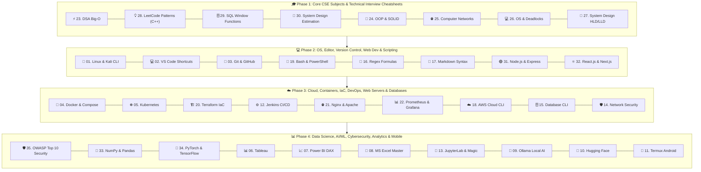

<div align="center">

# 📻 BugFix FM
### *The Ultimate 35-Module Landmark CSE Core Subjects, AI/ML, Security & 50+ Tools Master Booklet*

[](https://github.com/techindro/Penetration-testing-toolkit/stargazers)
[](https://github.com/techindro/Penetration-testing-toolkit/network/members)
[](LICENSE)
[](https://github.com/techindro/Penetration-testing-toolkit/pulls)
[](https://github.com/techindro/Penetration-testing-toolkit)

<p align="center">
  <b>A complete landmark 35-module master booklet featuring Direct Raw Download Links 📥, Official Software Links 🌐, Memory Hooks 🧠, and 30+ enumerated commands & formulas per sheet covering OWASP Top 10 Security, Data Science, AI/ML, Web Dev, CSE Core Subjects, MAANG Interview Cheatsheets, and 50+ Tools.</b>
</p>

[Explore 35 Master Modules](#-35-master-modules-with-direct-raw-download-links) • [Visual Architecture](#-ecosystem-architecture) • [External Resources](#-essential-resources)

</div>

---

## ✨ Why BugFix FM?

- 📥 **Direct Raw Download Links:** Instantly download any Markdown sheet to your machine (`.md` raw links provided for all 35 modules).
- 🌐 **Official Tool Software Links:** Quick links to official download pages for VS Code, Git, Docker, Kubernetes, Nginx, Terraform, AWS CLI, etc.
- 🧠 **Memory Hooks & Mnemonics:** Packed with catchphrases, mnemonics (e.g. *All People Seem To Need Data Processing* for OSI 7 Layers), and instant visual memory triggers.
- 📑 **30+ Commands & Formulas Per Sheet:** Every sheet is packed with 30 enumerated commands, formulas, shortcuts, and code snippets.
- 🎓 **Complete CSE Curriculum + Interview Cheatsheets:** Node.js, React.js, Next.js, DSA Big-O, C++ STL LeetCode Patterns, SQL Window Functions, System Design Estimation, OOP/SOLID, OSI/Networking, OS Deadlocks + 50+ Engineering Tools.
- 🚀 **GitHub Browser Ready:** Press `.` on your keyboard anywhere in this repository to open full VS Code Web directly!

---

## 🎨 Ecosystem Architecture



---

## 📌 35 Master Modules with Direct Raw Download Links

| Module ID | Category / Subject | View Sheet | Direct RAW Download | Official Software |
| :-: | :--- | :-: | :-: | :-: |
| **01** | **🐧 Linux & Kali Linux** | [Open Sheet](01-linux-and-kali-shortcuts/SHEET.md) | [📥 Download RAW](https://raw.githubusercontent.com/techindro/Penetration-testing-toolkit/main/01-linux-and-kali-shortcuts/SHEET.md) | [Official Linux](https://www.kali.org/) |
| **02** | **💻 VS Code Editor** | [Open Sheet](02-vscode-keyboard-tricks/SHEET.md) | [📥 Download RAW](https://raw.githubusercontent.com/techindro/Penetration-testing-toolkit/main/02-vscode-keyboard-tricks/SHEET.md) | [Get VS Code](https://code.visualstudio.com/) |
| **03** | **🐙 Git & GitHub** | [Open Sheet](03-github-and-git-shortcuts/SHEET.md) | [📥 Download RAW](https://raw.githubusercontent.com/techindro/Penetration-testing-toolkit/main/03-github-and-git-shortcuts/SHEET.md) | [Get Git CLI](https://git-scm.com/) |
| **04** | **🐳 Docker Containers** | [Open Sheet](04-docker-containers-tricks/SHEET.md) | [📥 Download RAW](https://raw.githubusercontent.com/techindro/Penetration-testing-toolkit/main/04-docker-containers-tricks/SHEET.md) | [Get Docker](https://www.docker.com/) |
| **05** | **☸️ Kubernetes (kubectl)** | [Open Sheet](05-kubernetes-kubectl-tricks/SHEET.md) | [📥 Download RAW](https://raw.githubusercontent.com/techindro/Penetration-testing-toolkit/main/05-kubernetes-kubectl-tricks/SHEET.md) | [Get Kubectl](https://kubernetes.io/) |
| **06** | **📊 Tableau Analytics** | [Open Sheet](06-tableau-analytics-formulas/SHEET.md) | [📥 Download RAW](https://raw.githubusercontent.com/techindro/Penetration-testing-toolkit/main/06-tableau-analytics-formulas/SHEET.md) | [Get Tableau](https://www.tableau.com/) |
| **07** | **📈 Power BI DAX** | [Open Sheet](07-powerbi-dax-formulas/SHEET.md) | [📥 Download RAW](https://raw.githubusercontent.com/techindro/Penetration-testing-toolkit/main/07-powerbi-dax-formulas/SHEET.md) | [Get Power BI](https://powerbi.microsoft.com/) |
| **08** | **📗 MS Excel Master** | [Open Sheet](08-excel-master-formulas/SHEET.md) | [📥 Download RAW](https://raw.githubusercontent.com/techindro/Penetration-testing-toolkit/main/08-excel-master-formulas/SHEET.md) | [Get MS Excel](https://www.microsoft.com/excel) |
| **09** | **🦙 Ollama Local AI** | [Open Sheet](09-ollama-local-ai-tricks/SHEET.md) | [📥 Download RAW](https://raw.githubusercontent.com/techindro/Penetration-testing-toolkit/main/09-ollama-local-ai-tricks/SHEET.md) | [Get Ollama](https://ollama.com/) |
| **10** | **🤗 Hugging Face** | [Open Sheet](10-huggingface-cli-python-tricks/SHEET.md) | [📥 Download RAW](https://raw.githubusercontent.com/techindro/Penetration-testing-toolkit/main/10-huggingface-cli-python-tricks/SHEET.md) | [Hugging Face](https://huggingface.co/) |
| **11** | **📱 Termux Android** | [Open Sheet](11-termux-android-shortcuts/SHEET.md) | [📥 Download RAW](https://raw.githubusercontent.com/techindro/Penetration-testing-toolkit/main/11-termux-android-shortcuts/SHEET.md) | [Get Termux](https://f-droid.org/packages/com.termux/) |
| **12** | **⚙️ Jenkins CI/CD** | [Open Sheet](12-jenkins-cicd-shortcuts/SHEET.md) | [📥 Download RAW](https://raw.githubusercontent.com/techindro/Penetration-testing-toolkit/main/12-jenkins-cicd-shortcuts/SHEET.md) | [Get Jenkins](https://www.jenkins.io/) |
| **13** | **📓 JupyterLab & Magic** | [Open Sheet](13-jupyterlab-keyboard-shortcuts/SHEET.md) | [📥 Download RAW](https://raw.githubusercontent.com/techindro/Penetration-testing-toolkit/main/13-jupyterlab-keyboard-shortcuts/SHEET.md) | [Get Jupyter](https://jupyter.org/) |
| **14** | **🛡️ Network Security** | [Open Sheet](14-cyber-security-network-diagnostics/SHEET.md) | [📥 Download RAW](https://raw.githubusercontent.com/techindro/Penetration-testing-toolkit/main/14-cyber-security-network-diagnostics/SHEET.md) | [Get Nmap](https://nmap.org/) |
| **15** | **🗄️ Database CLI** | [Open Sheet](15-database-cli-shortcuts/SHEET.md) | [📥 Download RAW](https://raw.githubusercontent.com/techindro/Penetration-testing-toolkit/main/15-database-cli-shortcuts/SHEET.md) | [PostgreSQL](https://www.postgresql.org/) |
| **16** | **🔣 Regex Formulas** | [Open Sheet](16-regex-regular-expressions/SHEET.md) | [📥 Download RAW](https://raw.githubusercontent.com/techindro/Penetration-testing-toolkit/main/16-regex-regular-expressions/SHEET.md) | [Regex101](https://regex101.com/) |
| **17** | **📝 Markdown Syntax** | [Open Sheet](17-markdown-syntax-cheatsheet/SHEET.md) | [📥 Download RAW](https://raw.githubusercontent.com/techindro/Penetration-testing-toolkit/main/17-markdown-syntax-cheatsheet/SHEET.md) | [GFM Guide](https://github.github.com/gfm/) |
| **18** | **☁️ AWS Cloud CLI** | [Open Sheet](18-aws-cloud-cli-shortcuts/SHEET.md) | [📥 Download RAW](https://raw.githubusercontent.com/techindro/Penetration-testing-toolkit/main/18-aws-cloud-cli-shortcuts/SHEET.md) | [Get AWS CLI](https://aws.amazon.com/cli/) |
| **19** | **📜 Shell Scripting** | [Open Sheet](19-bash-powershell-scripting-shortcuts/SHEET.md) | [📥 Download RAW](https://raw.githubusercontent.com/techindro/Penetration-testing-toolkit/main/19-bash-powershell-scripting-shortcuts/SHEET.md) | [PowerShell](https://github.com/PowerShell/PowerShell) |
| **20** | **🏗️ Terraform IaC** | [Open Sheet](20-terraform-iac-shortcuts/SHEET.md) | [📥 Download RAW](https://raw.githubusercontent.com/techindro/Penetration-testing-toolkit/main/20-terraform-iac-shortcuts/SHEET.md) | [Get Terraform](https://www.terraform.io/) |
| **21** | **🌐 Nginx & Apache** | [Open Sheet](21-nginx-apache-webservers/SHEET.md) | [📥 Download RAW](https://raw.githubusercontent.com/techindro/Penetration-testing-toolkit/main/21-nginx-apache-webservers/SHEET.md) | [Get Nginx](https://nginx.org/) |
| **22** | **📊 Prometheus & Grafana** | [Open Sheet](22-prometheus-grafana-monitoring/SHEET.md) | [📥 Download RAW](https://raw.githubusercontent.com/techindro/Penetration-testing-toolkit/main/22-prometheus-grafana-monitoring/SHEET.md) | [Get Grafana](https://grafana.com/) |
| **23** | **⚡ DSA Big-O Complexity** | [Open Sheet](23-dsa-data-structures-algorithms-complexity/SHEET.md) | [📥 Download RAW](https://raw.githubusercontent.com/techindro/Penetration-testing-toolkit/main/23-dsa-data-structures-algorithms-complexity/SHEET.md) | [Big-O CheatSheet](https://www.bigocheatsheet.com/) |
| **24** | **🧩 OOP & Design Patterns** | [Open Sheet](24-oop-principles-design-patterns/SHEET.md) | [📥 Download RAW](https://raw.githubusercontent.com/techindro/Penetration-testing-toolkit/main/24-oop-principles-design-patterns/SHEET.md) | [Refactoring Guru](https://refactoring.guru/) |
| **25** | **🌐 Computer Networks** | [Open Sheet](25-computer-networks-protocols-subnetting/SHEET.md) | [📥 Download RAW](https://raw.githubusercontent.com/techindro/Penetration-testing-toolkit/main/25-computer-networks-protocols-subnetting/SHEET.md) | [Wireshark](https://www.wireshark.org/) |
| **26** | **💻 Operating Systems** | [Open Sheet](26-operating-systems-deadlock-scheduling/SHEET.md) | [📥 Download RAW](https://raw.githubusercontent.com/techindro/Penetration-testing-toolkit/main/26-operating-systems-deadlock-scheduling/SHEET.md) | [Ubuntu OS](https://ubuntu.com/) |
| **27** | **📐 System Design (HLD/LLD)** | [Open Sheet](27-system-design-hld-lld-cap-theorem/SHEET.md) | [📥 Download RAW](https://raw.githubusercontent.com/techindro/Penetration-testing-toolkit/main/27-system-design-hld-lld-cap-theorem/SHEET.md) | [ByteByteGo](https://bytebytego.com/) |
| **28** | **💡 LeetCode Patterns (C++)** | [Open Sheet](28-leetcode-dsa-patterns-cheatsheet/SHEET.md) | [📥 Download RAW](https://raw.githubusercontent.com/techindro/Penetration-testing-toolkit/main/28-leetcode-dsa-patterns-cheatsheet/SHEET.md) | [LeetCode](https://leetcode.com/) |
| **29** | **🗄️ SQL Interview Queries** | [Open Sheet](29-sql-queries-window-functions-joins/SHEET.md) | [📥 Download RAW](https://raw.githubusercontent.com/techindro/Penetration-testing-toolkit/main/29-sql-queries-window-functions-joins/SHEET.md) | [SQLZoo](https://sqlzoo.net/) |
| **30** | **📐 System Design Estimation** | [Open Sheet](30-system-design-interview-estimation-formulas/SHEET.md) | [📥 Download RAW](https://raw.githubusercontent.com/techindro/Penetration-testing-toolkit/main/30-system-design-interview-estimation-formulas/SHEET.md) | [System Design Primer](https://github.com/donnemartin/system-design-primer) |
| **31** | **🟢 Node.js & Express CLI** | [Open Sheet](31-nodejs-npm-express-cli-shortcuts/SHEET.md) | [📥 Download RAW](https://raw.githubusercontent.com/techindro/Penetration-testing-toolkit/main/31-nodejs-npm-express-cli-shortcuts/SHEET.md) | [Get Node.js](https://nodejs.org/) |
| **32** | **⚛️ React.js & Next.js** | [Open Sheet](32-reactjs-vite-nextjs-hooks-shortcuts/SHEET.md) | [📥 Download RAW](https://raw.githubusercontent.com/techindro/Penetration-testing-toolkit/main/32-reactjs-vite-nextjs-hooks-shortcuts/SHEET.md) | [Get Next.js](https://nextjs.org/) |
| **33** | **🐍 NumPy & Pandas** | [Open Sheet](33-numpy-pandas-data-science-cheatsheet/SHEET.md) | [📥 Download RAW](https://raw.githubusercontent.com/techindro/Penetration-testing-toolkit/main/33-numpy-pandas-data-science-cheatsheet/SHEET.md) | [NumPy](https://numpy.org/) |
| **34** | **🤖 PyTorch & TensorFlow** | [Open Sheet](34-scikit-learn-tensorflow-pytorch-ai-cheatsheet/SHEET.md) | [📥 Download RAW](https://raw.githubusercontent.com/techindro/Penetration-testing-toolkit/main/34-scikit-learn-tensorflow-pytorch-ai-cheatsheet/SHEET.md) | [PyTorch](https://pytorch.org/) |
| **35** | **🛡️ OWASP Top 10 Security** | [Open Sheet](35-cyber-security-owasp-top-10-cheatsheet/SHEET.md) | [📥 Download RAW](https://raw.githubusercontent.com/techindro/Penetration-testing-toolkit/main/35-cyber-security-owasp-top-10-cheatsheet/SHEET.md) | [OWASP Org](https://owasp.org/) |

---

## 📻 Essential Resources

- 🌐 [PortSwigger Web Security Academy](https://portswigger.net/web-security) - Free interactive web security learning platform.
- 📖 [OWASP Web Security Testing Guide (WSTG)](https://github.com/OWASP/wstg) - Industry standard security auditing methodology.
- 🧰 [PayloadsAllTheThings](https://github.com/swisskyrepo/PayloadsAllTheThings) - Comprehensive security study guide & payload repository.
- 📋 [SecLists](https://github.com/danielmiessler/SecLists) - Security wordlists for username/password discovery and testing.

---

## 📂 Repository Directory Layout

```
BugFix-FM-Master-Shortcut-Booklet/
├── 01-linux-and-kali-shortcuts/        # SHEET.md (30+ Commands: Easy -> Medium -> Hard)
├── 02-vscode-keyboard-tricks/          # SHEET.md (30 Shortcuts: Easy -> Medium -> Hard)
├── 03-github-and-git-shortcuts/        # SHEET.md (30 Commands + Camera Photo Mnemonic)
├── 04-docker-containers-tricks/        # SHEET.md (30 Commands: Easy -> Medium -> Hard)
├── 05-kubernetes-kubectl-tricks/       # SHEET.md (30 Commands: Easy -> Medium -> Hard)
├── 06-tableau-analytics-formulas/      # SHEET.md (Easy -> Medium -> Hard)
├── 07-powerbi-dax-formulas/            # SHEET.md (Easy -> Medium -> Hard)
├── 08-excel-master-formulas/           # SHEET.md (30+ Formulas: Easy -> Medium -> Hard)
├── 09-ollama-local-ai-tricks/          # SHEET.md (Easy -> Medium -> Hard)
├── 10-huggingface-cli-python-tricks/   # SHEET.md (Easy -> Medium -> Hard)
├── 11-termux-android-shortcuts/        # SHEET.md (Easy -> Medium -> Hard)
├── 12-jenkins-cicd-shortcuts/          # SHEET.md (Easy -> Medium -> Hard)
├── 13-jupyterlab-keyboard-shortcuts/   # SHEET.md (Easy -> Medium -> Hard)
├── 14-cyber-security-network-diagnostics/ # SHEET.md (Easy -> Medium -> Hard)
├── 15-database-cli-shortcuts/          # SHEET.md (Easy -> Medium -> Hard)
├── 16-regex-regular-expressions/       # SHEET.md (Easy -> Medium -> Hard)
├── 17-markdown-syntax-cheatsheet/      # SHEET.md (Easy -> Medium -> Hard)
├── 18-aws-cloud-cli-shortcuts/         # SHEET.md (Easy -> Medium -> Hard)
├── 19-bash-powershell-scripting-shortcuts/ # SHEET.md (Easy -> Medium -> Hard)
├── 20-terraform-iac-shortcuts/         # SHEET.md (Easy -> Medium -> Hard)
├── 21-nginx-apache-webservers/         # SHEET.md (Easy -> Medium -> Hard)
├── 22-prometheus-grafana-monitoring/   # SHEET.md (Easy -> Medium -> Hard)
├── 23-dsa-data-structures-algorithms-complexity/ # SHEET.md (Easy -> Medium -> Hard)
├── 24-oop-principles-design-patterns/  # SHEET.md (Easy -> Medium -> Hard)
├── 25-computer-networks-protocols-subnetting/    # SHEET.md (OSI Mnemonic + Ports Memory Hooks)
├── 26-operating-systems-deadlock-scheduling/     # SHEET.md (Easy -> Medium -> Hard)
├── 27-system-design-hld-lld-cap-theorem/         # SHEET.md (Easy -> Medium -> Hard)
├── 28-leetcode-dsa-patterns-cheatsheet/          # SHEET.md (C++ STL Code)
├── 29-sql-queries-window-functions-joins/        # SHEET.md (Easy -> Medium -> Hard)
├── 30-system-design-interview-estimation-formulas/# SHEET.md (Easy -> Medium -> Hard)
├── 31-nodejs-npm-express-cli-shortcuts/          # SHEET.md (30 Items: Easy -> Medium -> Hard)
├── 32-reactjs-vite-nextjs-hooks-shortcuts/       # SHEET.md (30 Items: Easy -> Medium -> Hard)
├── 33-numpy-pandas-data-science-cheatsheet/      # SHEET.md (30 Items: Easy -> Medium -> Hard)
├── 34-scikit-learn-tensorflow-pytorch-ai-cheatsheet/# SHEET.md (30 Items: Easy -> Medium -> Hard)
├── 35-cyber-security-owasp-top-10-cheatsheet/    # SHEET.md (30 Items: Easy -> Medium -> Hard)
└── README.md                           # Master Booklet Entry
```

---

<div align="center">

### ⭐ If you find BugFix FM helpful, please give it a Star! ⭐

**Maintained by [Shubham Patel (techindro)](https://github.com/techindro)**

</div>
