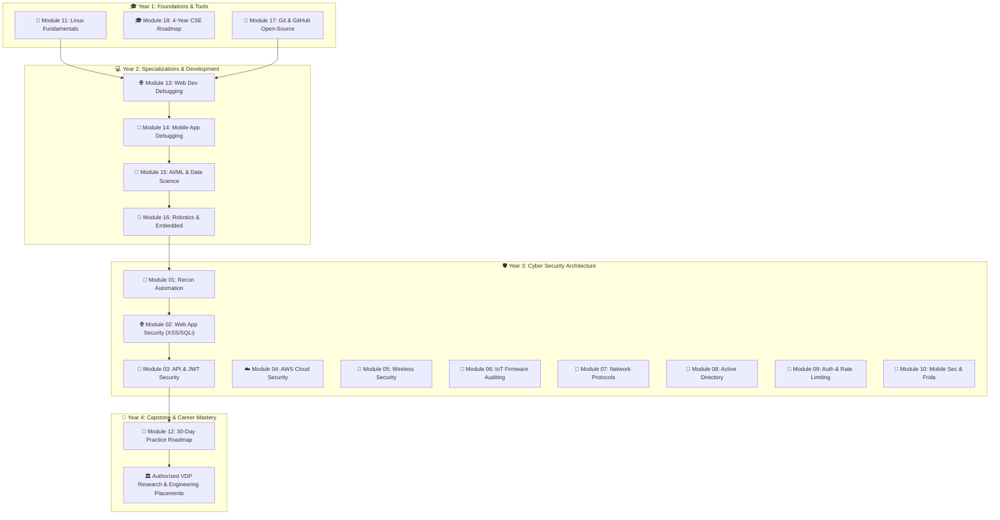

# 📻 BugFix FM Booklet
> **The Ultimate 4-Year Computer Science Engineering, Troubleshooting, Open-Source & Security Auditing Master Booklet**

Curated by **Shubham Patel (techindro)**

**⚠️ DISCLAIMER:** This booklet is strictly for educational purposes, authorized research, and defensive security auditing. Performing unauthorized attacks or scanning networks without explicit, written permission/scope is completely illegal and punishable by law.

---

## 🎨 BugFix FM Booklet Ecosystem & Roadmap Architecture



---

## 📌 BugFix FM Booklet Master Index

| Module | Category / Field | Core Topics & Solved Bugs | Documentation Link |
| :--- | :--- | :--- | :---: |
| **01. Recon Automation** | Security Auditing | Asset discovery math, Shannon entropy | [View Sheet](01-live-bug-bounty-automation/SHEET.md) |
| **02. Web App Security** | Security Auditing | SQL Injection, XSS, CSP headers | [View Sheet](02-web-app-exploitation/SHEET.md) |
| **03. API & JWT Security** | Security Auditing | JWT HMAC-SHA256, FFUF fuzzing | [View Sheet](03-api-security-token-manipulation/SHEET.md) |
| **04. AWS Cloud Security** | Cloud Engineering | S3 Policies, IMDSv2 metadata | [View Sheet](04-cloud-security-aws/SHEET.md) |
| **05. Wireless Security** | Network Security | WPA2 PMK PBKDF2, Aircrack-ng | [View Sheet](05-wireless-auditing/SHEET.md) |
| **06. IoT & Firmware** | Hardware Security | Magic bytes, Binwalk filesystem | [View Sheet](06-iot-cctv-firmware-auditing/SHEET.md) |
| **07. Network Protocols** | Network Engineering | ARP headers, Dynamic ARP Inspection | [View Sheet](07-network-spoofing-mitm/SHEET.md) |
| **08. Active Directory** | Enterprise Security | NTLMv2 math, LLMNR fallback | [View Sheet](08-active-directory-windows/SHEET.md) |
| **09. Auth & Rate Limit** | Application Security | Leaky Bucket math, Hydra syntax | [View Sheet](09-authentication-attacks-brute-force/SHEET.md) |
| **10. Mobile Sec & Frida** | Mobile Security | Android Network Config, Frida V8 | [View Sheet](10-mobile-sec-kernelsu/SHEET.md) |
| **11. Linux & Kali** | OS & Administration | `chmod` SUID, `grep`/`awk`/`sed` | [View Sheet](11-linux-kali-fundamentals/SHEET.md) |
| **12. 30-Day Practice** | Study Roadmap | 30-Day step-by-step curriculum | [View Sheet](12-practice-roadmap-30-days/SHEET.md) |
| **13. Web Dev Troubleshooting** | Web Development | CORS errors, `node_modules` reset, MongoDB Atlas, `.env` | [View Sheet](13-cse-web-dev-troubleshooting/SHEET.md) |
| **14. App Dev Troubleshooting** | Mobile Development | Gradle JDK mismatch, `flutter doctor`, ADB server kills | [View Sheet](14-cse-app-dev-troubleshooting/SHEET.md) |
| **15. AI/ML & Data Science** | Artificial Intelligence | PyTorch CUDA verification, Jupyter kernels, Pandas memory | [View Sheet](15-cse-aiml-data-science/SHEET.md) |
| **16. Robotics & Embedded** | Robotics Engineering | Serial `/dev/ttyUSB0` permission denied, ROS2, ESP32 boot | [View Sheet](16-cse-robotics-embedded/SHEET.md) |
| **17. Git & Open Source** | Software Engineering | SSH key setup, Merge conflict resolution, Open-source PR | [View Sheet](17-cse-git-github-opensource/SHEET.md) |
| **18. 4-Year CSE Roadmap** | Academic & Career | 8-Semester roadmap, DSA, System Design (LLD/HLD), Placements | [View Sheet](18-cse-4-year-roadmap/SHEET.md) |

---

## 📻 BugFix FM Booklet - Essential External Resources

- 🌐 [PortSwigger Web Security Academy](https://portswigger.net/web-security) - Free interactive web security learning platform.
- 📖 [OWASP Web Security Testing Guide (WSTG)](https://github.com/OWASP/wstg) - Industry standard security auditing methodology.
- 🧰 [PayloadsAllTheThings](https://github.com/swisskyrepo/PayloadsAllTheThings) - Comprehensive security study guide & payload repository.
- 📋 [SecLists](https://github.com/danielmiessler/SecLists) - Security wordlists for username/password discovery and testing.

---

## 📂 BugFix FM Booklet Directory Structure

```
BugFix-FM-Booklet/
├── 01-live-bug-bounty-automation/        # SHEET.md
├── 02-web-app-exploitation/              # SHEET.md
├── 03-api-security-token-manipulation/   # SHEET.md
├── 04-cloud-security-aws/                # SHEET.md
├── 05-wireless-auditing/                 # SHEET.md
├── 06-iot-cctv-firmware-auditing/        # SHEET.md
├── 07-network-spoofing-mitm/             # SHEET.md
├── 08-active-directory-windows/          # SHEET.md
├── 09-authentication-attacks-brute-force/ # SHEET.md
├── 10-mobile-sec-kernelsu/               # SHEET.md
├── 11-linux-kali-fundamentals/           # SHEET.md
├── 12-practice-roadmap-30-days/          # SHEET.md
├── 13-cse-web-dev-troubleshooting/       # SHEET.md
├── 14-cse-app-dev-troubleshooting/       # SHEET.md
├── 15-cse-aiml-data-science/             # SHEET.md
├── 16-cse-robotics-embedded/             # SHEET.md
├── 17-cse-git-github-opensource/         # SHEET.md
├── 18-cse-4-year-roadmap/                # SHEET.md
└── README.md                             # Main Root Booklet Entry
```

---
**📻 BugFix FM Booklet Maintainer:** [Shubham Patel (techindro)](https://github.com)
