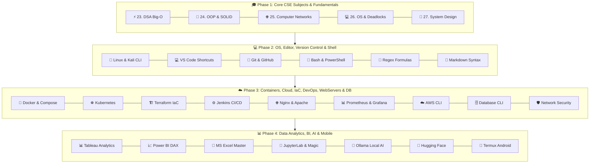

<div align="center">

# 📻 BugFix FM
### *The Ultimate 27-Module CSE Core Subjects & 35+ Tools Master Booklet*

[](https://github.com/techindro/Penetration-testing-toolkit/stargazers)
[](https://github.com/techindro/Penetration-testing-toolkit/network/members)
[](LICENSE)
[](https://github.com/techindro/Penetration-testing-toolkit/pulls)
[](https://github.com/techindro/Penetration-testing-toolkit)

<p align="center">
  <b>A complete 27-module master booklet covering CSE Core Engineering Subjects (DSA, OOP, Computer Networks, Operating Systems, System Design) and 35+ Professional Developer, Cloud, DevOps, AI, and Security Tools.</b>
</p>

[Explore 27 Master Modules](#-27-master-shortcut-modules) • [Visual Architecture](#-ecosystem-architecture) • [External Resources](#-essential-resources)

</div>

---

## ✨ Why BugFix FM?

- 🎓 **Complete CSE Curriculum + Tools:** DSA Big-O, OOP/SOLID, OSI/Networking, OS Deadlocks, System Design (CAP Theorem) + 35+ Professional Engineering Tools.
- 🎯 **3-Level Difficulty Classification:** Commands categorized into 🟢 **Level 1 (Easy)**, 🟡 **Level 2 (Medium)**, and 🔴 **Level 3 (Hard Pro Tricks)**.
- 🗣️ **Natural Human Language:** Clear, jargon-free explanations of complex concepts, DAX formulas, regex, and CLI flags.
- 💡 **Real-World Practical Examples:** Every single shortcut, formula, DAX measure, XLOOKUP, and CLI tool includes a concrete usage example.
- 🚀 **GitHub Browser Ready:** Press `.` on your keyboard anywhere in this repository to open full VS Code Web directly!

---

## 🎨 Ecosystem Architecture



---

## 📌 27 Master Shortcut & Core Modules

| Module ID | Category / Subject | Core Focus & Highlighted Formulas | Booklet Link |
| :-: | :--- | :--- | :-: |
| **01** | **🐧 Linux & Kali Linux** | 🟢 `cd ~` • 🟡 `Ctrl+R` • 🔴 `sudo !!` & `nohup` | [**Open Sheet**](01-linux-and-kali-shortcuts/SHEET.md) |
| **02** | **💻 VS Code Editor** | 🟢 `Ctrl+P` • 🟡 `Ctrl+B` • 🔴 `Alt+Click` multi-cursor & `Ctrl+D` | [**Open Sheet**](02-vscode-keyboard-tricks/SHEET.md) |
| **03** | **🐙 Git & GitHub** | 🟢 `git init` -> `git push origin main` • 🟡 `git stash` • 🔴 `git reset --soft` & `git rebase` | [**Open Sheet**](03-github-and-git-shortcuts/SHEET.md) |
| **04** | **🐳 Docker Containers** | 🟢 `docker ps` • 🟡 `docker exec -it` • 🔴 `docker system prune -a` | [**Open Sheet**](04-docker-containers-tricks/SHEET.md) |
| **05** | **☸️ Kubernetes (kubectl)** | 🟢 `kubectl get pods` • 🟡 `port-forward` • 🔴 `rollout undo` & `force delete` | [**Open Sheet**](05-kubernetes-kubectl-tricks/SHEET.md) |
| **06** | **📊 Tableau Analytics** | 🟢 `Ctrl+W` • 🟡 `IF/THEN` • 🔴 FIXED / INCLUDE / EXCLUDE LOD | [**Open Sheet**](06-tableau-analytics-formulas/SHEET.md) |
| **07** | **📈 Power BI DAX** | 🟢 `SUM` • 🟡 `CALCULATE` • 🔴 `TOTALYTD` & YoY Growth % | [**Open Sheet**](07-powerbi-dax-formulas/SHEET.md) |
| **08** | **📗 MS Excel Master** | 🟢 `Alt+=` AutoSum • 🟡 `XLOOKUP` & `SUMIFS` • 🔴 `INDEX+MATCH` | [**Open Sheet**](08-excel-master-formulas/SHEET.md) |
| **09** | **🦙 Ollama Local AI** | 🟢 `ollama run` • 🟡 `ollama list` • 🔴 Custom `Modelfile` creation | [**Open Sheet**](09-ollama-local-ai-tricks/SHEET.md) |
| **10** | **🤗 Hugging Face** | 🟢 `huggingface-cli download` • 🟡 GGUF files • 🔴 Python `snapshot_download` | [**Open Sheet**](10-huggingface-cli-python-tricks/SHEET.md) |
| **11** | **📱 Termux Android** | 🟢 `pkg update` • 🟡 `termux-setup-storage` • 🔴 `sshd` phone server | [**Open Sheet**](11-termux-android-shortcuts/SHEET.md) |
| **12** | **⚙️ Jenkins CI/CD** | 🟢 `cleanWs()` • 🟡 Declarative `Jenkinsfile` • 🔴 Curl API triggers | [**Open Sheet**](12-jenkins-cicd-shortcuts/SHEET.md) |
| **13** | **📓 JupyterLab & Magic** | 🟢 `Shift+Enter` • 🟡 `A`/`B`/`D+D` • 🔴 Magic `%timeit` & `%debug` | [**Open Sheet**](13-jupyterlab-keyboard-shortcuts/SHEET.md) |
| **14** | **🛡️ Network Security** | 🟢 `nc -zv` • 🟡 `nmap -sS -sV` • 🔴 `tcpdump` & `tshark` extraction | [**Open Sheet**](14-cyber-security-network-diagnostics/SHEET.md) |
| **15** | **🗄️ Database CLI** | 🟢 `psql \l` • 🟡 `mongosh find()` • 🔴 Redis `FLUSHALL` & keys | [**Open Sheet**](15-database-cli-shortcuts/SHEET.md) |
| **16** | **🔣 Regex Formulas** | 🟢 `\d+` & `\w+` • 🟡 Email & IP regex • 🔴 Positive Lookaheads `(?=...)` | [**Open Sheet**](16-regex-regular-expressions/SHEET.md) |
| **17** | **📝 Markdown Syntax** | 🟢 `# Header` • 🟡 GFM Alerts `[!NOTE]` • 🔴 KaTeX Math & Mermaid | [**Open Sheet**](17-markdown-syntax-cheatsheet/SHEET.md) |
| **18** | **☁️ AWS Cloud CLI** | 🟢 `aws s3 ls` • 🟡 `aws configure` • 🔴 `aws s3 sync` & STS identity | [**Open Sheet**](18-aws-cloud-cli-shortcuts/SHEET.md) |
| **19** | **📜 Shell Scripting** | 🟢 `export VAR` • 🟡 Bash `for` loop • 🔴 `crontab -e` & PowerShell regex | [**Open Sheet**](19-bash-powershell-scripting-shortcuts/SHEET.md) |
| **20** | **🏗️ Terraform IaC** | 🟢 `terraform init` • 🟡 `terraform plan` & `apply` • 🔴 `terraform state list` | [**Open Sheet**](20-terraform-iac-shortcuts/SHEET.md) |
| **21** | **🌐 Nginx & Apache** | 🟢 `nginx -t` • 🟡 `nginx -s reload` • 🔴 Reverse proxy `proxy_pass` | [**Open Sheet**](21-nginx-apache-webservers/SHEET.md) |
| **22** | **📊 Prometheus & Grafana** | 🟢 `node_load1` • 🟡 `rate(http_requests_total[5m])` • 🔴 `histogram_quantile` | [**Open Sheet**](22-prometheus-grafana-monitoring/SHEET.md) |
| **23** | **⚡ DSA Big-O Complexity** | 🟢 Big-O Order • 🟡 Array/Tree Complexity • 🔴 QuickSort vs MergeSort | [**Open Sheet**](23-dsa-data-structures-algorithms-complexity/SHEET.md) |
| **24** | **🧩 OOP & Design Patterns** | 🟢 4 OOP Pillars • 🟡 SOLID Principles • 🔴 Singleton & Factory Patterns | [**Open Sheet**](24-oop-principles-design-patterns/SHEET.md) |
| **25** | **🌐 Computer Networks** | 🟢 7 OSI Layers • 🟡 Ports 80, 443, 3306, 5432 • 🔴 IPv4 Subnetting Formulas | [**Open Sheet**](25-computer-networks-protocols-subnetting/SHEET.md) |
| **26** | **💻 Operating Systems** | 🟢 Process vs Thread • 🟡 Round Robin Scheduling • 🔴 4 Deadlock Conditions | [**Open Sheet**](26-operating-systems-deadlock-scheduling/SHEET.md) |
| **27** | **📐 System Design (HLD/LLD)** | 🟢 Horizontal vs Vertical Scaling • 🟡 LRU/LFU Caching • 🔴 CAP Theorem | [**Open Sheet**](27-system-design-hld-lld-cap-theorem/SHEET.md) |

---

## 📻 Essential Resources

- 🌐 [PortSwigger Web Security Academy](https://portswigger.net/web-security) - Free interactive web security learning platform.
- 📖 [OWASP Web Security Testing Guide (WSTG)](https://github.com/OWASP/wstg) - Industry standard security auditing methodology.
- 🧰 [PayloadsAllTheThings](https://github.com/swisskyrepo/PayloadsAllTheThings) - Comprehensive security study guide & payload repository.
- 📋 [SecLists](https://github.com/danielmiessler/SecLists) - Security wordlists for username/password discovery and testing.

---

## 📂 Repository Directory Layout

```
BugFix-FM-Master-Shortcut-Booklet/
├── 01-linux-and-kali-shortcuts/        # SHEET.md (Easy -> Medium -> Hard)
├── 02-vscode-keyboard-tricks/          # SHEET.md (Easy -> Medium -> Hard)
├── 03-github-and-git-shortcuts/        # SHEET.md (Easy -> Medium -> Hard)
├── 04-docker-containers-tricks/        # SHEET.md (Easy -> Medium -> Hard)
├── 05-kubernetes-kubectl-tricks/       # SHEET.md (Easy -> Medium -> Hard)
├── 06-tableau-analytics-formulas/      # SHEET.md (Easy -> Medium -> Hard)
├── 07-powerbi-dax-formulas/            # SHEET.md (Easy -> Medium -> Hard)
├── 08-excel-master-formulas/           # SHEET.md (Easy -> Medium -> Hard)
├── 09-ollama-local-ai-tricks/          # SHEET.md (Easy -> Medium -> Hard)
├── 10-huggingface-cli-python-tricks/   # SHEET.md (Easy -> Medium -> Hard)
├── 11-termux-android-shortcuts/        # SHEET.md (Easy -> Medium -> Hard)
├── 12-jenkins-cicd-shortcuts/          # SHEET.md (Easy -> Medium -> Hard)
├── 13-jupyterlab-keyboard-shortcuts/   # SHEET.md (Easy -> Medium -> Hard)
├── 14-cyber-security-network-diagnostics/ # SHEET.md (Easy -> Medium -> Hard)
├── 15-database-cli-shortcuts/          # SHEET.md (Easy -> Medium -> Hard)
├── 16-regex-regular-expressions/       # SHEET.md (Easy -> Medium -> Hard)
├── 17-markdown-syntax-cheatsheet/      # SHEET.md (Easy -> Medium -> Hard)
├── 18-aws-cloud-cli-shortcuts/         # SHEET.md (Easy -> Medium -> Hard)
├── 19-bash-powershell-scripting-shortcuts/ # SHEET.md (Easy -> Medium -> Hard)
├── 20-terraform-iac-shortcuts/         # SHEET.md (Easy -> Medium -> Hard)
├── 21-nginx-apache-webservers/         # SHEET.md (Easy -> Medium -> Hard)
├── 22-prometheus-grafana-monitoring/   # SHEET.md (Easy -> Medium -> Hard)
├── 23-dsa-data-structures-algorithms-complexity/ # SHEET.md (Easy -> Medium -> Hard)
├── 24-oop-principles-design-patterns/  # SHEET.md (Easy -> Medium -> Hard)
├── 25-computer-networks-protocols-subnetting/    # SHEET.md (Easy -> Medium -> Hard)
├── 26-operating-systems-deadlock-scheduling/     # SHEET.md (Easy -> Medium -> Hard)
├── 27-system-design-hld-lld-cap-theorem/         # SHEET.md (Easy -> Medium -> Hard)
└── README.md                           # Master Booklet Entry
```

---

<div align="center">

### ⭐ If you find BugFix FM helpful, please give it a Star! ⭐

**Maintained by [Shubham Patel (techindro)](https://github.com/techindro)**

</div>
